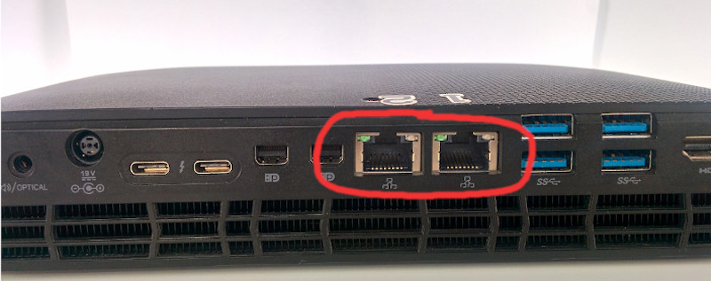
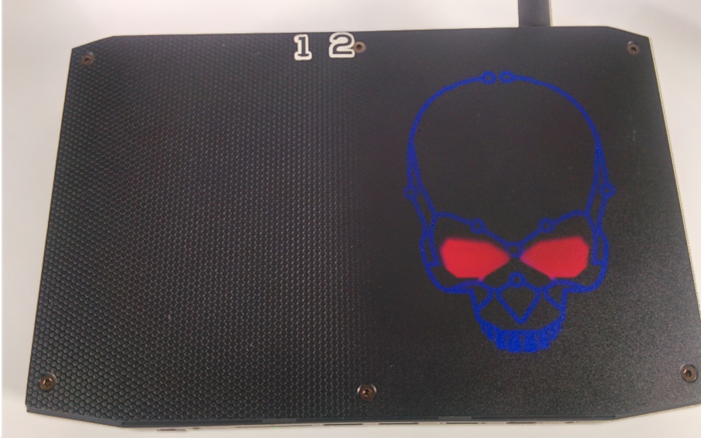
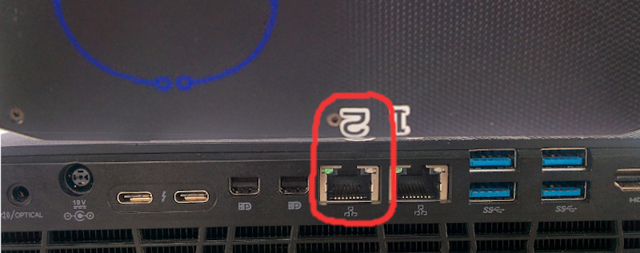
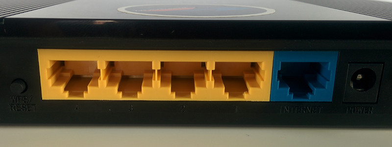

## Configurar su red local

## Tabla de direcciones
### IPv4  

**Red:** 192.168.2.0/128  
**Puerta de enlace:** 192.168.2.121  
**Broadcast:** 192.168.2.127  
**Mascara de subred:** 255.255.255.128  
**Dominio:** warptech.lan

**Ip Inicial**: 192.168.2.1  
**Ip Final**: 192.168.2.120  

| Dispositivo 	| IPv4 	| host 	|
|	:-----------	|:----:	|:-------	|
| Router 	| .121 	| router. 	|
| Servidor 	| .122 	| w3m. 	|  
| Servidor nombre de dominio	| .122 	| ns. 	|

## [WarpSkynet](warp_skynet.md)

Identificar el puerto ethernet(RJ45) asignado para esta tarea en el servidor **warp skynet**

En la parte posterior del servidor existen dos puertos ethernet(RJ45).

Que estaran numerados por la parte superior del servidor.

El puerto con el **número 2** sera el encargado de establecer la red local necesaria para que sus dispositivos se comuniquen con los servicios.

## Configurar router

1. Establecer IPv4 estatica designada por **Warp Skynet**.
2. Deshabilitar DHCP IPv4 y IPv6 (en caso de soportarlo).
3. Conectar **ethernet 2** de **Warp Skynet** a puerto ethernet LAN(Red de área local) del router.

;